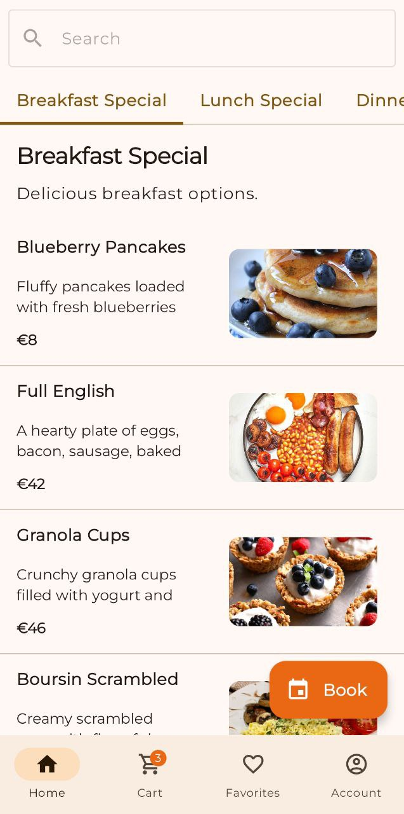
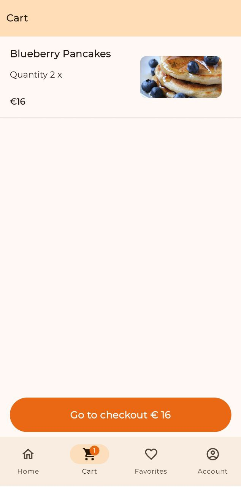

<h1 align="center">
  Platea
</h1>

## Objective of the Application:

This mobile application is designed for table reservations and food ordering in restaurants. It allows customers to book a table, place food orders for dine-in or delivery, and track their orders seamlessly. Additionally, it includes a module that streamlines the ordering process for waiters and ensures efficient order delivery to the kitchen. The app is built with a clear distinction between user roles, providing an intuitive and user-friendly interface for customers and restaurant staff.

## Download

Coming Soon

## Screenshots

  
  
  

  
  
  

  
  
  

  
  
  

# Tech Stack

## Core Libraries:

 - Kotlin
 - Jetpack Compose
 - ViewModel 
 - Room Database 
 - DataStore Preferences 
   
## Dependency Injection:

 - Dagger Hilt 
   
## Networking:

 - Retrofit 
 - OkHttp 
 - Kotlinx Serialization 

## Firebase Services:

 - Firebase BOM 
 - Firebase Crashlytics 
 - Firebase Analytics 
 - Firebase Messaging 
 - Firebase Performance Monitoring 
   
## UI & UX:

 - Accompanist Permissions 
 - Compose Calendar 
 - Material 3 
 - Icons 
   
## Navigation:

 - Jetpack Navigation 
   
## Image Loading:

 - Coil 
   
## Logging:

 - Timber 

# Utilities:

 - Splash Screen API 
 - LibPhoneNumber 
