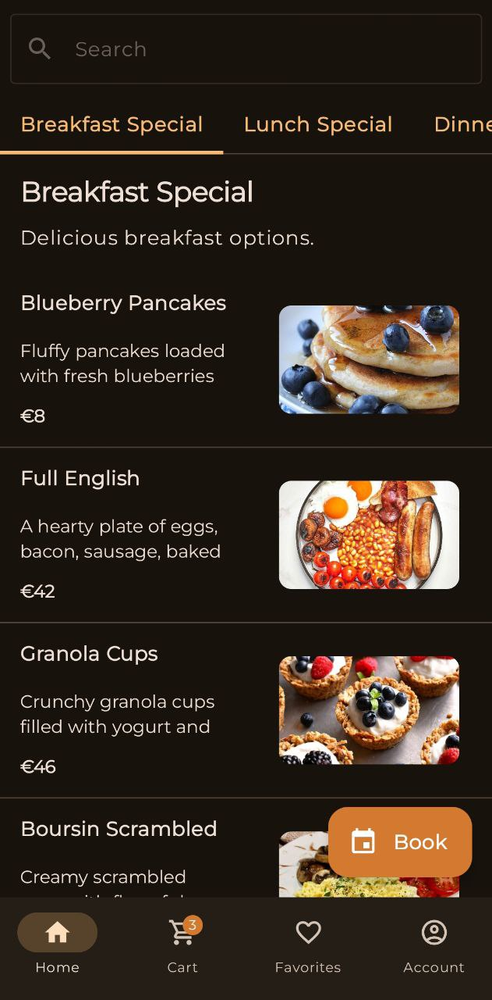
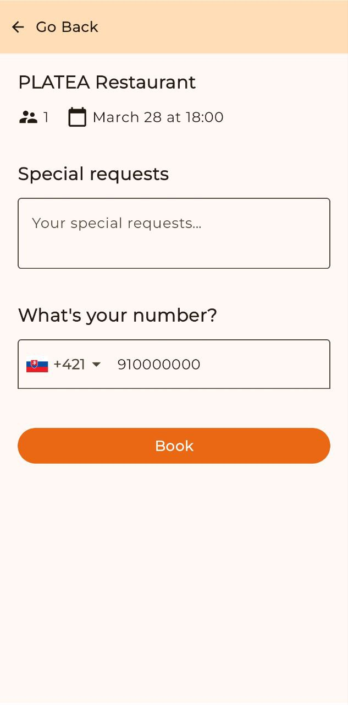
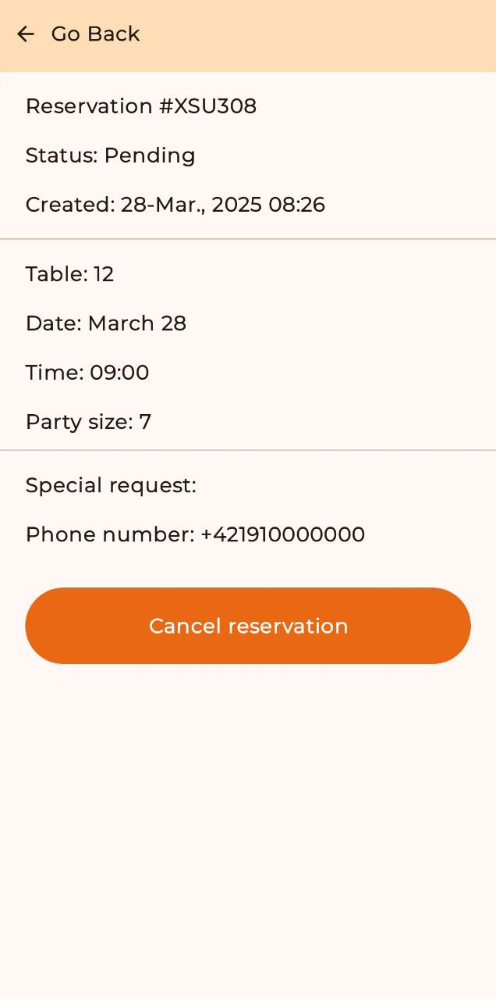

<h1 align="center">
  Platea
</h1>

## Objective of the Application:

The mobile application is designed for table reservations and food ordering in restaurants. It enables customers to book tables, place dine-in or delivery orders, and track them seamlessly. The system also includes dedicated modules for Waiters, Chefs, and Admins.
In addition, a web-based admin panel was developed to manage the restaurant, and the back-end, built with a REST API, handles communication with both the web and mobile applications.

## Download

Go to the [releases page](https://github.com/YehorSk/Restaurant-Reservation-Ordering-App/releases) to download the latest available apk.

## Screenshots

  
  
  

  
  
  

  
  
  

  
  
  

# Mobile App Tech Stack

## Core Libraries:

 - Kotlin
 - Jetpack Compose
 - ViewModel 
 - Room Database 
 - DataStore Preferences 
   
## Dependency Injection:

 - Dagger Hilt 
   
## Networking:

 - Retrofit 
 - OkHttp 
 - Kotlinx Serialization 

## Firebase Services:

 - Firebase BOM 
 - Firebase Crashlytics 
 - Firebase Analytics 
 - Firebase Messaging 
 - Firebase Performance Monitoring 
   
## UI & UX:

 - Accompanist Permissions 
 - Compose Calendar 
 - Material 3 
 - Icons 
   
## Navigation:

 - Jetpack Navigation 
   
## Image Loading:

 - Coil 
   
## Logging:

 - Timber 

# Utilities:

 - Splash Screen API 
 - LibPhoneNumber 
